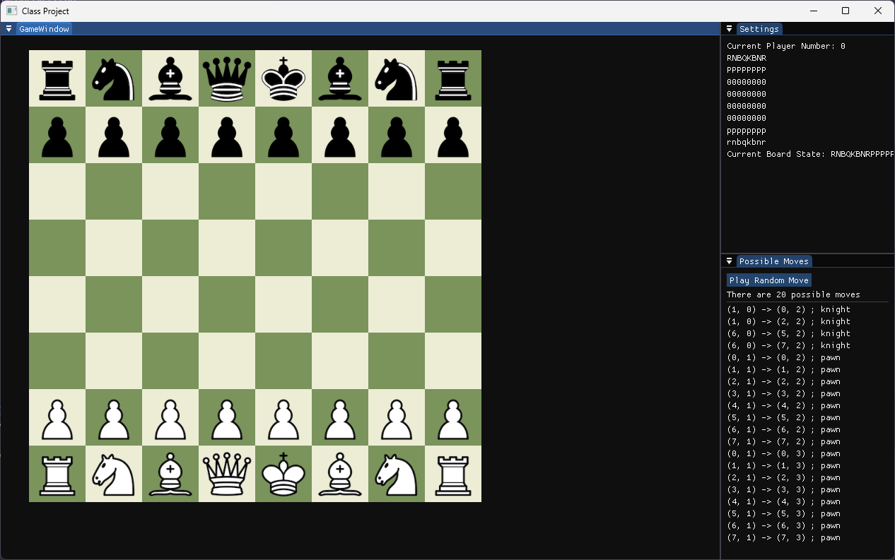
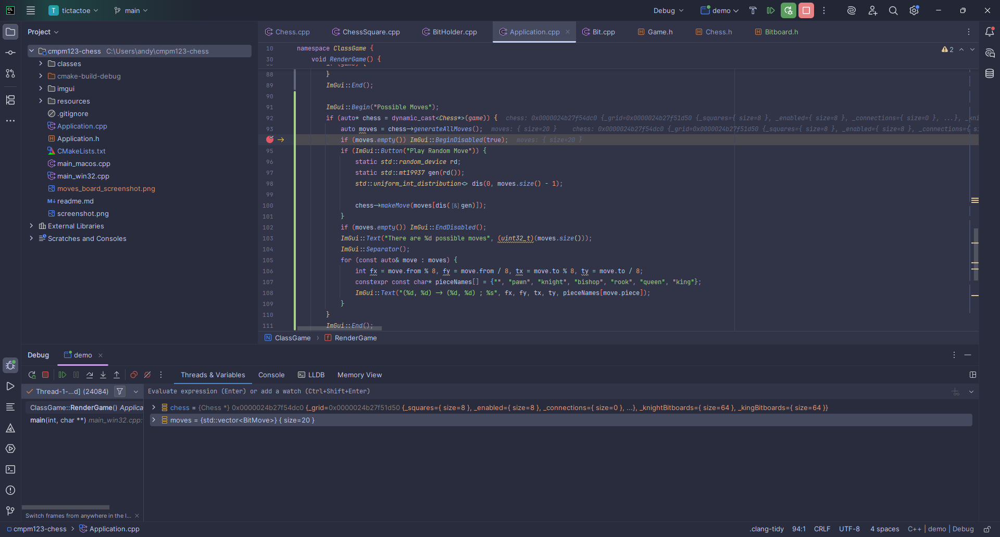

My implementation for move generation just uses the bitboard methods explained in class. I added a couple quality of life things to bitboards (just some easy operator overloads to make working with them a bit easier for me).
I also used bitboards and shifts for pawn move generation.

I added an ImGui window that shows the list of possible moves and gives the user a button to play one at random (it's really funny to watch the king run around the screen capturing pieces).

It's also possible to make all the implemented moves manually (you can't make illegal moves, but not all legal moves are currently available yet).

I also added defined values to the ChessPiece enum so that I could use it in a bit's gameTag to easily get which piece a bit represents without worrying about compiler weirdnesses (I am pretty sure that enum default values are well defined, but I don't want to trust that and would rather do it myself).

## Screenshots

